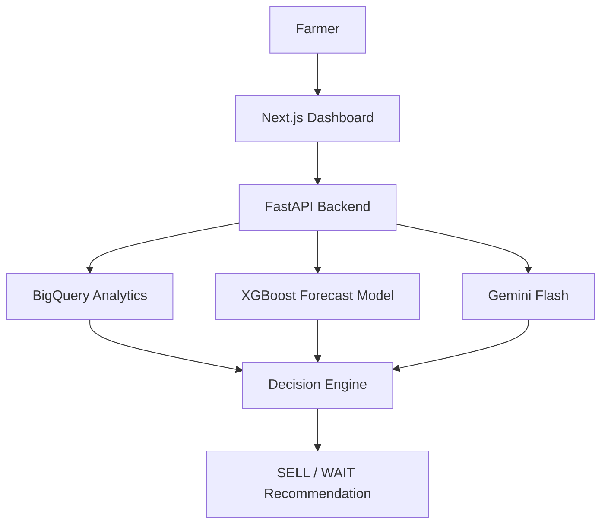
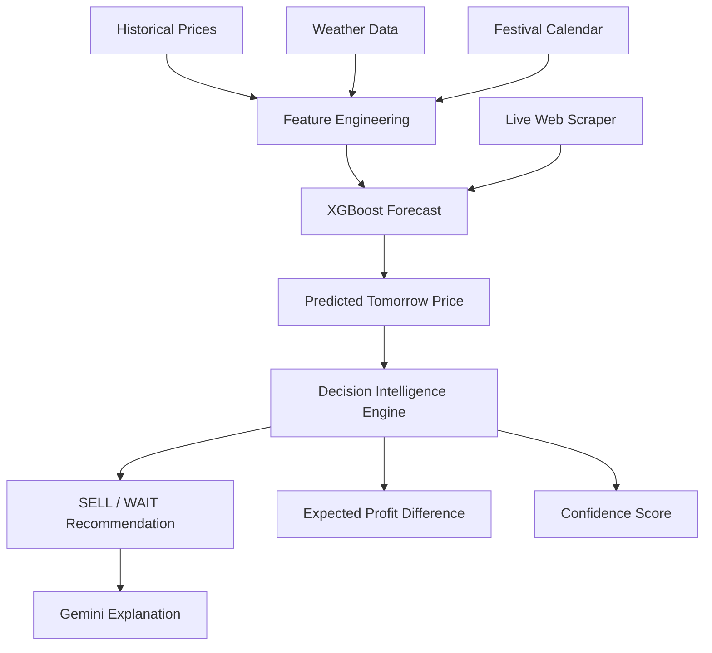

# JasmineIQ

JasmineIQ is a decision-intelligence platform for Udupi Mallige and Jaaji cultivators. It combines historical market prices, weather data, and seasonal signals to help farmers make better selling decisions and reduce losses from perishability and market volatility.

## Problem Statement

Flower farmers often have to decide whether to sell today or wait for a better price tomorrow, with limited visibility into market trends, weather, and demand shifts. JasmineIQ turns those signals into a simple, explainable `SELL` or `WAIT` recommendation.

## Solution Overview

JasmineIQ is built around a decision-intelligence pipeline rather than a pure forecasting app:



## Decision Intelligence Pipeline



## Key Features

### Analytical Data Warehouse
Google BigQuery stores historical market, weather, and festival data and supports SQL-based trend analysis for the dashboard and assistant.

### Offline Forecasting & Live Inference
The XGBoost regressor is trained offline using historical BigQuery data (engineered with lag features, rolling windows, and seasonal signals). 
At inference time, the model is fed real-time data: our live web scraper fetches today's price from The Canara Post on every page load, substituting it as the `Lag_1` feature to drastically improve tomorrow's prediction.

### Live Data Ingestion (Web Scraping)
The FastAPI backend uses BeautifulSoup to scrape live Udupi Jasmine prices from local news sources on every request. This ensures the dashboard is always up-to-date and self-sustaining day after day.

### Explainable Recommendations
Each recommendation includes the predicted price change, weather influence, festival impact, expected profit difference, and a confidence score.

### Interactive Dashboards
The frontend shows market analytics and forecast charts using Recharts.

### Gemini Farming Assistant
The assistant uses Gemini Flash to turn analytics into concise, farmer-friendly explanations.

## Tech Stack

**Frontend**
- Next.js 15
- TypeScript
- Tailwind CSS
- shadcn/ui
- Recharts

**Backend, AI, and Data**
- FastAPI
- Google BigQuery
- XGBoost
- Pandas and NumPy
- Google Gemini Flash

**Deployment**
- Docker
- Google Cloud Run
- Artifact Registry

## Folder Structure

- `backend/` contains the FastAPI app, ML pipeline, and BigQuery setup scripts.
- `frontend/` contains the Next.js dashboard, analytics pages, and assistant UI.

## Dataset Notice

The historical dataset used to train the machine learning models belongs exclusively to the Udupi Mallige app and cannot be shared or distributed publicly. As such, the dataset and model files are excluded from this repository. 

For a complete technical breakdown of how the datasets were sourced, merged, and engineered for the machine learning model, please see [TECH_STACK.md](TECH_STACK.md).

## Local Setup

### Backend

```bash
cd backend
python -m venv venv
venv\Scripts\activate
pip install -r requirements.txt
python setup_bq.py
python training/train_model.py
uvicorn main:app --reload
```

*Note: Since the proprietary dataset is excluded from this repository, `train_model.py` and the backend will automatically generate synthetic dummy data so you can still run and test the application locally without any errors.*

Create `backend/.env` with the required keys before running the API:

```env
GEMINI_API_KEY=your_key_here
OPENWEATHER_API_KEY=your_key_here
GOOGLE_CLOUD_PROJECT=your_project_id
```

### Frontend

```bash
cd frontend
npm install
npm run dev
```

Create `frontend/.env.local` and point it at the backend API:

```env
NEXT_PUBLIC_API_URL=http://localhost:8000/api
```

The frontend reads this value in `frontend/src/lib/api.ts` and uses it for all API requests.

## Deployment

For full, foolproof deployment instructions to Google Cloud (Cloud Run), please see `DEPLOYMENT.md`. It contains the exact copy-paste terminal commands needed to get both the backend and frontend live.

## Future Scope

1. Regional Market Expansion
   Extend coverage beyond Udupi to other jasmine markets.

2. AI Farmer Alerts
   Deliver proactive alerts through WhatsApp or SMS.

3. Assistant Performance Enhancement
   Optimize the Gemini Assistant's latency, context caching, and response quality to provide even faster, more hyper-localized, and highly accurate answers to farmers.
